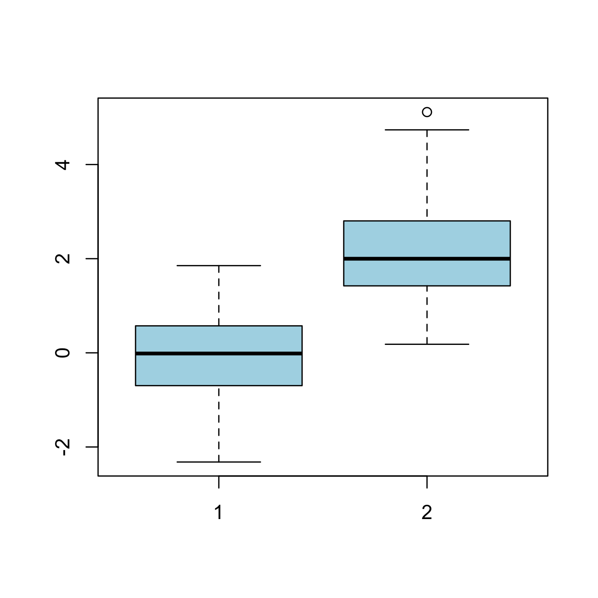
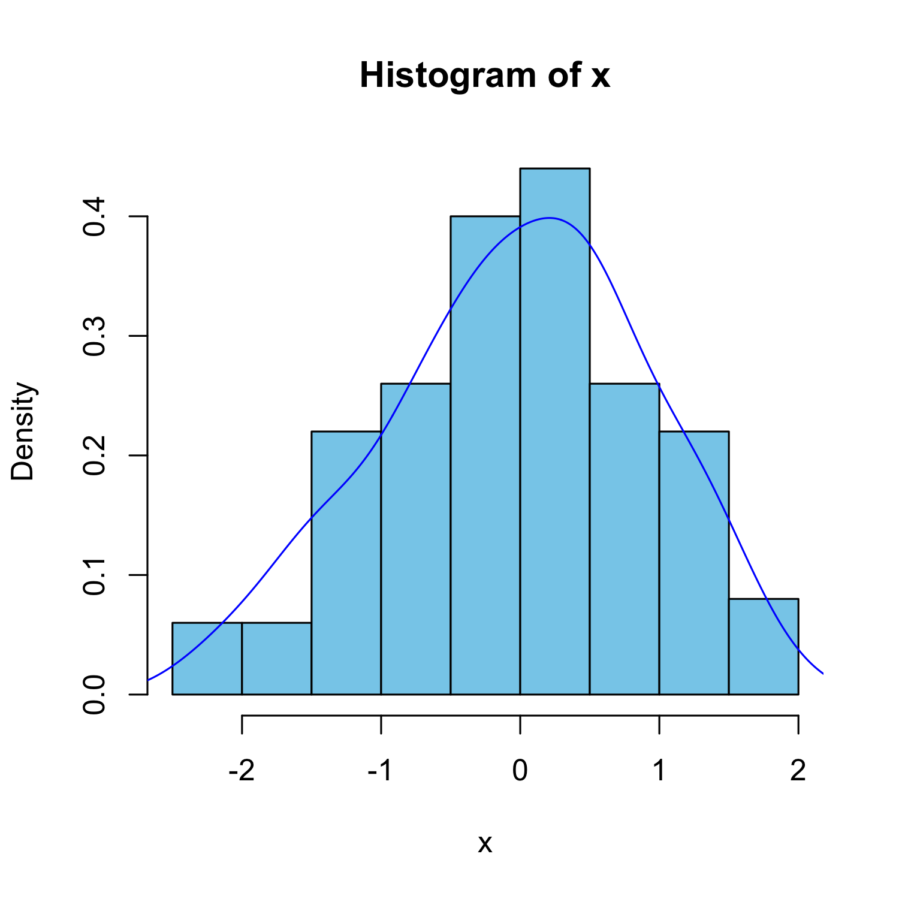
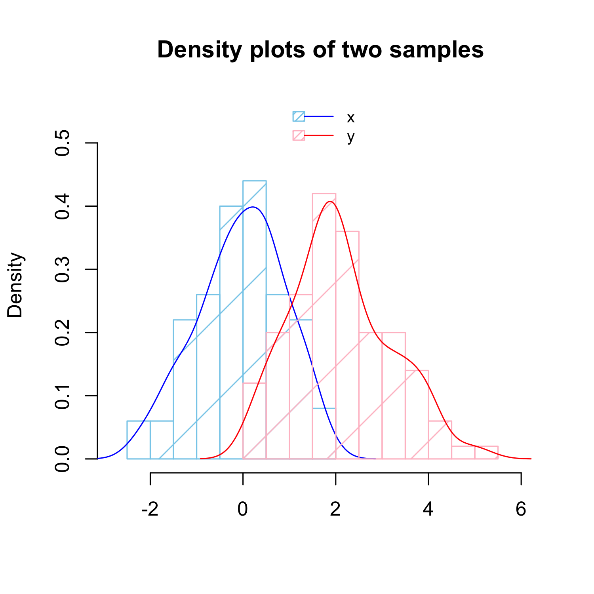

% Introduction to R and Biostatistics
% [Leonardo Collado Torres](http://www.biostat.jhsph.edu/~lcollado/)
% Nov 9, 2012


# Prerequisites

## 

Hopefully

* You read the 3 the *papers* from [Introducing R and Biostatistics to first year LCG students (2012 version)](http://fellgernon.tumblr.com/post/34677935591/introducing-r-and-biostatistics-to-first-year-lcg#.UJwncOOe918)
	
Ideally

* You also have [RStudio](http://www.rstudio.com/ide/) installed.

# Welcome to the Genomics sciences =)

## They are very diverse!

* Main branches
	* Molecular biology
	* Biochemistry
	* Mathematics
	* Computing
* Close to the core:
	* Immunology, developmental biology, phylogenetics, ...
* Wide variety of model organisms
	* Bacteria, plants, higher eurakyotes, communities, ...


## Who are we?

[LCG](http://www.lcg.unam.mx)'s main focus is in developing researchers.

* From the wet biologist to the do-it-all to the more mathematical side
* But not any kind. The program trains you to understand a wide gamma of languages.
* Understand enough to __communicate__. That's it!
* Then you specialize in something.
	* You might start in your 4th year or a bit earlier.
	


## What defines a researcher?

* We use the scientific method.
* Thus we observe a phenomenon, make hypothesis, gather data, and test them.
* We aim to be objective!
	* Can we really ignore our prejudices and inner subjectivity?
* We also have to be able to communicate our ideas to others. _Or try to_.


# Statistics and philosophy

## Statistics

Richard Royall, _Statistical Evidence_, 1997

> Science looks to statistics for help in __interpreting data__.

> Statistics is supposed to provide objective methods for representic scientific data as __evidence__ and for measuring the __strength__ of that evidence.

## 

> Statistics serves science in other ways as well, contributing to both efficiency and objectivity through theories for the __design of experiments__ and __decision-making__, for example.

> But its most important task is to provide __objective quantitative alternatives to personal judgement__ for integrating the evidence produced by experiments and observational studies.

## Useful scenario (Royall, 1997)

There is a disease that you are interested in and you have a single diagnostic test.

Lets say that you have two incompatible cases:

* In case A, a person has a disease ($D$). 
	* The probability that the test will be positive $P(T^+|D) = 0.95$. 
	* Thus, $P(T^-|D) = 0.05$.

## 

* In case B, the person does not have the disease ($D^c$).
	* The probability that the test will be positive is $P(T^+|D^c) = 0.02$.
	* Thus, $P(T^-|D^c) = 0.98$.
* You apply the test to Juan, and it comes out positive. This is our observation.

## Three questions

1. What do __I believe__, now that I have this observation?
2. What should I __do__, now that I have this observation?
3. What does this observation tell me about case A versus case B? (How should I interpret this observation as __evidence__ regarding A versus B?)

## Three possible conclusions

1. Juan probably does not have the disease.
2. Juan should be treated for the disease.
3. The test result is evidence that Juan has the disease.

## Three interpretations

1. Belief: Bayesian statistics.
2. Decision: Decision theory that is linked to frequentist statistics.
3. Evidence: Likelihood statistics.

## Why is the first one a _belief_?

__Bayes theorem__
Let $A, B$ be sets contained in the sample space. Then:
$$ P(A | B) = \frac{P(A \cap B)}{P(B)}$$
if $P(B) > 0$.

Note that if $P(A) > 0$ then
$$P(B | A) = \frac{P(B \cap A)}{P(A)}$$
and thus $P(B | A) P(A) = P(B \cap A)$


## 

But $P(A \cap B) = P(B \cap A)$ so
$$ P(A |B ) = \frac{ P(B | A) P(A)}{P(B)} $$

__Multiplication rule__
Let $A, B$ be sets contained in the sample space. Then:
$$ P(B) = P(B|A)P(A) + P(B|A^c)P(A^c) $$


## 

Using Bayes theorem and the multiplication rule, we have:

$$ P(D|T^+) = \frac{ P(T^+ | D) P(D)}{ P(T^+ | D) P(D) + P(T^+ | D^c) P(D^c)} $$
As $P(D^c) = 1 - P(D)$ and substituting the values we assumed earlier, we get that
$$ P(D|T^+) = \frac{0.95 P(D)}{0.95 P(D)+ 0.02 (1 - P(D))} $$


## 

Therefore, our answer to question 1 depends on $P(D)$, which we call the _prior probability_.

So you can think of $P(D)$ as the combination of all prior knowledge and your beliefs, and $P(D|T^+)$ as your new (updated) beliefs after observing the data. In this case, after seeing Juan get a positive test.


## What about question 2?

We need to know the possible actions that we can take and their risks (consequences).

For example, if the treatment is harmless, inexpensive and not treating a sick person leads to terrible consequences, then we will go for it and treat Juan.

So we need other information.


## Question 3.

The idea behind determining the evidence and it's measure of strength is so that you may use it along with other information you may have to do what you think is best.


## Conclusions

As you can see, there are three main divisions of statistical thinking.

But you don't have to choose a side. Use what is out there if you are __clear__ about what you are asking and the methods you use are compatible.

The wrong thing to do is to claim something when what you used doesn't answer that question!


# Statistical models

## Purpose

* One of the reasons we use them is to try to uncover causes by studying relationships between variables.
* Although statistical relationships do not necessarily imply causal relationships, they do give us a starting point for further research.

Seber and Lee, _Linear Regression Analysis_, 2003

## Basics

* We are interested in some variables, normally just one which we call the _response_.
* We want to study how it depends on a set of variables called _explanatory variables_.
* Example: risk of heart attack explained by blood pressure, age, gender, cholesterol level, etc.

Seber and Lee, _Linear Regression Analysis_, 2003

## Exam grades example


 

Faraway, _Linear Models with R_, 2005

## Uses

Once we have a statistical model we can

* use it for prediction.
* test hypothesis.
* estimate parameters and give a measure of uncertainty.

* As one of my professors said, 80% of statistics is linear models.


# Why do __I__ need statistics?


## Are we observing something that could happen by chance?

That is a big question that we will ask ourselves very frequently.

In other words, are we observing something __unexpected__?

This is the problem of hypothesis testing with the null hypothesis being _chance_.


## We have seen that you need statistics

To be objective

To estimate a parameter of interest and give a measure of uncertainty

To explain relationships between variables

To test your hypothesis

## You will need biostatistics

Biostatistics is statistics applied to biological problems. 

No matter what you do in science, you will need statistics at some point or another.

* How much? The basics.
	* Takes around 2 semester-long courses to learn them (mostly frequentist)
* _But I can collaborate with a statistician_
	* True, but it will be very hard to do so without a common language.

# R

## Why R?

* It's free (open source)
* Available on Windows, Mac, Linux/Unix.
* Easily to customize and expand with libraries called _packages_
	* Check out [CRAN](http://cran.r-project.org) and [Bioconductor](http://bioconductor.org)
* A lot of people in academia use it!
* Great for reproducibility (more later)


## Some cons

* It has a big learning curve
* No buttons which is a big difference if you are used to Excel...
* Can be very heterogeneous since lots of developers are working on different parts

## RStudio

[RStudio](http://www.rstudio.com/ide/)

I highly recommend it as your first R user interface.

It's very friendly: menus, all the windows you want, highlighting, ...

Once you learn to use RStudio you _might_ want to try out other options which generally involve quite a bit of customization. Or you _might_ be happy ever after with RStudio!

## R code

You will notice some R code in the next slides followed by it's output.

If you want to get the same results as me, just copy and paste them into R

Note that

```
# This symbol is used as a comment sign.
# Anything after will not be considered R code.
```


## R is vectored


```r
x <- 1
y <- c(1, 2, 3)
x + y
```

```
## [1] 2 3 4
```

```r
z <- 1:3
y - z
```

```
## [1] 0 0 0
```

```r
1:20
```

```
##  [1]  1  2  3  4  5  6  7  8  9 10 11 12
## [13] 13 14 15 16 17 18 19 20
```


## R as a calculator

Take Royall's example from the beginning. We know that:
$$ P(D|T^+) = \frac{0.95 P(D)}{0.95 P(D)+ 0.02 (1 - P(D))} $$

So, what is the $P(D|T^+)$ if $P(D) = 0.001$?

Well, lets use R as a calculator!


```r
0.95 * 0.001/(0.95 * 0.001 + 0.02 * (1 - 
    0.001))
```

```
## [1] 0.04539
```


## R as a programming language

We want more. We want to check if $P(D|T^+)$ is greater when $P(D) = 0.001, 0.20,$ or $0.5$.

To simplify things, we can write a function and check that it works:


```r
pr.d.given.t <- function(pr.d) {
    0.95 * pr.d/(0.95 * pr.d + 0.02 * (1 - 
        pr.d))
}
pr.d.given.t(0.001)
```

```
## [1] 0.04539
```


##

Now we can find the maximum one sequentially

```r
pr.d.given.t(0.001) < pr.d.given.t(0.2)
```

```
## [1] TRUE
```

```r
pr.d.given.t(0.001) < pr.d.given.t(0.5)
```

```
## [1] TRUE
```

```r
pr.d.given.t(0.2) < pr.d.given.t(0.5)
```

```
## [1] TRUE
```

```r
pr.d.given.t(0.5)
```

```
## [1] 0.9794
```


## R as a graphics device

Not enough!

Lets look at $P(D|T^+)$ for all possible values of $P(D)$


##


```r
pr.d <- seq(0.001, 0.999, by = 0.001)
plot(pr.d, pr.d.given.t(pr.d), type = "l", 
    col = "blue")
```

 


## Finding help


```r
apropos("norm")
```

```
##  [1] "dlnorm"         "dnorm"         
##  [3] "halfnorm"       "norm"          
##  [5] "normalizePath"  "plnorm"        
##  [7] "pnorm"          "qlnorm"        
##  [9] "qnorm"          "qqnorm"        
## [11] "qqnorm.default" "qqnorml"       
## [13] "rlnorm"         "rnorm"
```

```r
`?`(pnorm)
args(rnorm)
```

```
## function (n, mean = 0, sd = 1) 
## NULL
```


# The Normal distribution

## PDF

Let $X$ be the random variable that has a Normal distribution with mean $\mu$ and variance $\sigma^2$. Then it's probability density function (pdf) is given by the following equation:

$$ f_X(x) = \frac{1}{\sqrt{2\pi \sigma^2}} \exp \left( -\frac{(x - \mu)^2}{2 \sigma^2} \right) $$

If $Z \sim N(0, 1)$ then it's density is:

$$ f_Z(z) = \frac{1}{\sqrt{2\pi}} \exp \left(- \frac{z^2}{2} \right) $$

Very famous and highly useful because of the Central Limit Theorem (check [wiki](http://en.wikipedia.org/wiki/Central_limit_theorem) and [this useful applet](http://onlinestatbook.com/stat_sim/sampling_dist/index.html)).

## Lets plot its density


```r
x <- seq(-5, 5, by = 0.01)
args(dnorm)
```

```
## function (x, mean = 0, sd = 1, log = FALSE) 
## NULL
```

```r
y <- dnorm(x, 0, 1)
```


##


```r
plot(x, y, type = "l", col = "forest green")
```

 


## 

That was neat, because we know the __parameters__ which describe the __population__. 

But in reality, we only observe a __sample__. And from the sample, we get __statistics__ such as the _sample mean_ and _sample variance_.

## Starting from a sample

First, lets generate two random samples.


```r
args(rnorm)
```

```
## function (n, mean = 0, sd = 1) 
## NULL
```

```r
set.seed(101)
x <- rnorm(100)
set.seed(102)
y <- rnorm(100, 2)
```


_Exploratory Data Analysis_ is the first step when working backwards.

It relies heavily on plots

## Plot


```r
plot(x, y)
```

 


## Boxplot


```r
boxplot(x, y, col = "light blue")
```

 


## Histogram


```r
hist(x, freq = FALSE, col = "skyblue")
```

 


## 

With estimated density line


```r
hist(x, freq = FALSE, col = "skyblue")
lines(density(x), col = "blue")
```

 


## 

Overlaying two histograms


```r
# Create histogram and density line for
# sample 1 (x)
hist(x, xlim = range(c(x, y)) * 1.2, ylim = c(0, 
    0.55), main = "Density plots of two samples", 
    xlab = "", density = 2, freq = FALSE, 
    border = "skyblue", col = "skyblue")
lines(density(x), col = "blue")

# Add histogram and density line for
# sample 2 (y)
hist(y, xlim = range(c(x, y)), ylim = c(0, 
    0.55), main = "", density = 2, freq = FALSE, 
    border = "pink", col = "pink", add = TRUE)
lines(density(y), col = "red")

```


##


```r
# Add legend
legend("top", legend = c("x", "y"), 
			 
  col=c("blue", "red"), lty=1, bty="n", 
	density = 20, border = c("skyblue", "pink"),
	fill = c("skyblue", "pink"), cex=0.8)
# Example from my code a 140.776 exercise
```


##

 


## qqnorm


```r
qqnorm(x)
qqline(x, col = "red")
```

 


# Reproducibility

## What does it mean?

* For some sciences, it means being able to replicate other's work.
* You want this to be true, right? Otherwise no one will trust your results.
* In bioinformatics and biostatistics, we take reproducibility to a whole new level.
* Ideally, someone else can press a button and __everything__ will run smoothly and produce the same exact results.

## Reproducibility with R code

One way to promote reproducibility is using _self-contained_ documents.

Meaning that they have code and words explaining the results all in one single place.

An example? Look at [intro_R_Biostat_LCG_2012.Rmd](intro_R_Biostat_LCG_2012.Rmd)

Normally, we use it to create PDF reports for ourselves and collaborators.

## What is the problem?

Well, it normally involves learning \LaTeX and the ```Sweave```.

These files can look very complicated and take quite a bit of practice before you can get comfortable using them.


## knitr and markdown

[Markdown](http://daringfireball.net/projects/markdown/basics)

* It's a very simple mark_up_ syntax
* In RStudio
	* File > New > R Markdown
	* Click on _Markdown quick reference_

[knitr](http://yihui.name/knitr/)

* It can take Markdown files and export them to PDF or HTML files.
* Has a _ton_ of customization options
* Works great with RStudio
* Greatly benefits from [pandoc](http://johnmacfarlane.net/pandoc/)

## What is the point?

__You__ can learn how to use R with RStudio from the beginning and easily export your homeworks either in HTML or PDF format using __knitr__

Take a look at the same material in a webpage format [here](intro_R_Biostat_LCG_2012.html).

It's always good to start with the best practices, specially if they are very _simple_

## Thank you!

If you have questions, feel free to contact me!

##


```r
sessionInfo()
```

```
## R version 2.15.1 (2012-06-22)
## Platform: x86_64-apple-darwin9.8.0/x86_64 (64-bit)
## 
## locale:
## [1] C/en_US.UTF-8/C/C/C/C
## 
## attached base packages:
## [1] stats     graphics  grDevices
## [4] utils     datasets  methods  
## [7] base     
## 
## other attached packages:
## [1] faraway_1.0.5 knitr_0.8    
## 
## loaded via a namespace (and not attached):
## [1] digest_0.5.2   evaluate_0.4.2
## [3] formatR_0.6    plyr_1.7.1    
## [5] stringr_0.6.1  tools_2.15.1
```


